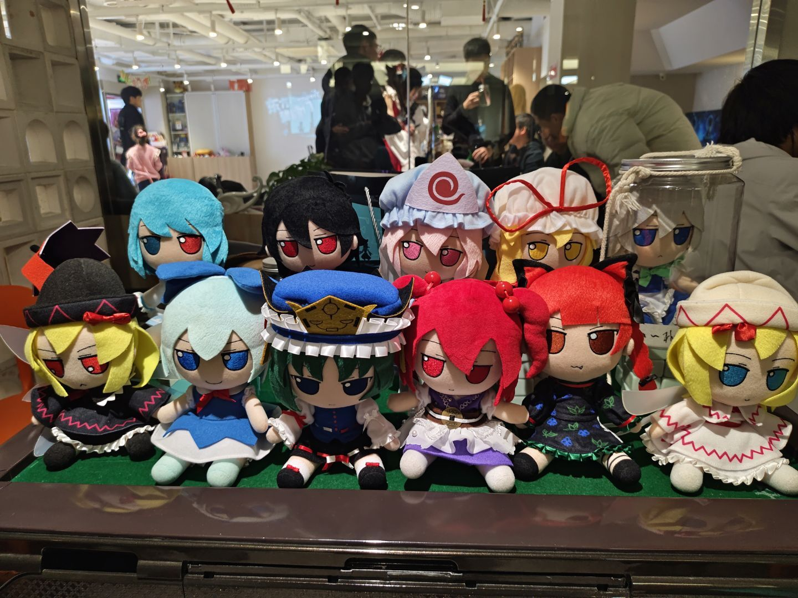

几周前的一个晚上，翻来覆去地总也睡不着，脑海里回顾着一年来的点点滴滴，总想写点什么作为记录，于是便在这年末有了这篇文章。

# 流水账

这部分写的如标题所示，回看一遍感觉写的好烂（），我的语文水平这辈子也就这样了，读者（若有）看不下去可以跳过。

## 上半年

一月，结束了大一上学期的期末考试，回到家乡过寒假，寒假期间还返回高中宣传了一下西电，又和高中的同学们去了一次 THP，还一起吃了一次火锅。

寒假期间 CTF 这一块儿也没落下，打了下 [NewYear CTF 2025](https://ctf.xidian.edu.cn/training/16)，感觉 [尖头曼的礼物](https://ctf.xidian.edu.cn/training/16?challenge=700) 这一题的收获最大，学了下怎么利用写 SQLite 文件来写入一个 PHP 木马，以及初步接触了反向 Shell 这种东西，为我后面渗透的学习打下了基础。

然后就是每年例行的拜年走亲戚了，二月就这样过了一半，不得不说没有寒假作业的寒假过的是真舒坦。

二月十七日，新学期伊始，刚开学空闲的我也给自己找了点事做：开始和舍友一起玩起了《杀戮尖塔》，买了本《东方儚月抄》，还下了个多邻国学起了日语，~~但是日语水平最后也就会认一点词、五十音还老认错~~。不过倒有一件事倒是坚持到了现在：下了个 APP 开始记账。

三月，买了《战地5》、《蔚蓝》，去了晒你东方组的组会，也和 ldx 们一起去了西交的 THP。战地和室友打得多，不过蔚蓝倒是玩玩停停，三月买的，结果七月才通关。（

四月，第一次学会了海淘，买了シノアサ的《花束とプリズム》和もや造的《咱与幻想乡 All season EX》，同时还整了只国内社团的白泽球，以及买了 fumo。现在想起来感觉年初的我东方厨力真强啊wwww，不过买了这些我都挺满意的。还有就是买了一条 1T 的固态硬盘，结果到年末就用的差不多了，早知道买 2T 的了（草），这下知道压岁钱都花哪去了。

五月，主要干的事就这几件：陕西 THO、Mini L-CTF、晒你祭。其中 L-CTF 虽然中途有插曲，但最终平稳结束，我也因此进入了 L-team。陕西 THO 依旧买买买，同人小说和评论合同志都买了点，感觉其中兰大、西北农林东方社一起搞的合同志《春江花霰》质量真的很高，好几篇文章我看完都有“小说还能这么写”的感受。我想，也许就是这种高质量的、自由的二次创作才是我热爱东方 Project 的根源吧。然后就是一年一度的晒你祭，我这种社恐老鼠人充当 staff 也是难为我了（bushi），不过意外的感觉不错？

然后我的生日也在五月，收到了同学送的零食、马克杯之类，还有的同学送的礼物很有格调：

值得一提的是五月末我把自己的 Redmi K40 进行了解 BL 锁以及刷入 Magisk，用上了 HyperCeiler 来优化 MIUI，不得不说有些 MIUI 特性简直就是一拖四。

六月，临近期末发现自己玩了四个月的我终于开始了女娲补天😭。数据结构这一块，离散数学这一块，大学物理这一块。结果月末的我好巧不巧还流感了，高数考前两天顶着头昏眼花还刷了几张卷子，幸好没挂科，但是这也为我后来一个月的生活埋下了伏笔。

六月末到七月中旬是军训的时候，我本就没好的流感也因为军训而加重了，训了一天感觉要死了的我去校医院查了一下，发现流感发展成肺炎了，接下来的几周就是一天两次雷打不动前往校医院输液和做雾化。

暑假，回到家一边给 MoeCTF 2025 出题一边打三角洲，以及被高中同学拉去打舞萌 DX（awmc），虽然我音游打的少，但是感觉挺好玩的(?)。

在家把蔚蓝通关了。

## 下半年

九月，大二上学期开始。买了《图灵完备》，正好这学期有微机原理和数字电路的课，感觉可以边玩边学点东西，感觉也确实学了点东西，游戏里设计计算机指令集，汇编做题的思想正好能套在对应学科的相应知识点上。

十月，去了陕西 THO 和幽闭星光 Live，陕西 THO 上买了如下周边，UESTC 社团的《赝饮同醉》读起来感觉质量并没有五月买的《春江花霰》质量高，不过有些文章读起来还是有点意思的。《星廻萃夜诗》这画集和《萃梦诗》的专辑（[B 站已公开](https://www.bilibili.com/video/BV1GnFYeBEGm)）倒是自从在华灯宴上看到以来我就很喜欢，正好收了，可惜一专《胧月苒凝华》线下没看到。至于东方卡面的 UNO 牌绘图质量挺高，一种牌有两种角色牌面，和朋友一起打挺好的。幽闭星光的 Live 同样非常震撼，只可惜在最近的中日形势下是很难再在线下看到了。

十月末，沾了 XDSEC 的光，前往广州作为 L-team 打了羊城杯，第一次接触线下赛中的渗透，非常感谢队友 xt、fifker 和 HDdss，也算在网安领域终于有了点被官方认可的成绩。

十一月，参加了校园迷你马拉松，5km 成绩 26:03，跑的人要④了，下次再也不去了。接着又参加了校内的疾风杯网安比赛，让我们直接打学校的 web 服务，基本没服务能打的进去的，最后找了个逻辑漏洞（草），结果奖品到现在还没发。月末和 salvarsan 学姐、E=hv 以及 HDdss 组了个队去西工大线下打了铸剑杯，和 L-team 的另一个队伍一起坠机了😭，黑盒 Web 题这招太狠了，看来还得继续练技术。

十二月，忙于复习。比起上半年只有大物、高数、数据结构、离散，这一学期属实是有点牢了：概率论、大物、微机原理、网安数基、数字电路。没有办法，学呗。

---

# 总结

*以下内容由 AI 辅助完成*

回看这由琐碎与闪光交织的一年，最大的感触或许是：生活从未在原地踏步，哪怕它以最平凡的方式流淌。

这一年，是探索与扎根的一年。从在 CTF 中第一次笨拙地写下 Webshell，到敢于站在线下赛的实战环境里与队友并肩；从单纯消费喜爱的作品，到主动海淘同人志、支持社团创作，甚至身体力行参与展会的运转——我正试图从被动的接收者，转变为更深入的参与者和创造者。技术的学习之路道阻且长，但每一次“懂了”的瞬间都无比踏实；兴趣也并非浅尝辄止，而是在阅读、欣赏与交流中，逐渐构建起属于自己的精神花园。

这一年，也是告别与遇见的一年。告别了只需应对考试的高中思维，迎来了需要自主平衡学业、兴趣、健康乃至社交的多元生活。我遇见了志同道合的队友，遇见了让自己惊叹的创作，也遇见了那个在病中坚持、在考前焦虑、在跑道上喘气却未曾真正放弃的自己。那些深夜的代码、输液的时光、读完一本好书的充实、以及 Live 现场鼓动耳膜的音浪……它们共同雕塑着这一年的轮廓。

流水账记下的是事，而事背后流淌的是成长。我依然会为期末“女娲补天”而头疼，为技术难点所困，也会继续沉迷游戏、花钱买“无用”的喜爱之物。但这或许就是生活本来的样子：在必须面对的压力中磨砺能力，在无用的热爱中安放灵魂。正是这些看似散落的片段，定义了我独一无二的 2025。

感谢这一年所有的相遇、经历与坚持。新的一年，愿自己依然能**保持好奇，脚踏实地，于无声处听惊雷，在寻常中见真趣**。

毕竟，这就是我热爱的生活，这里就是我的蓬莱之地呐。

2025年12月31日 夜