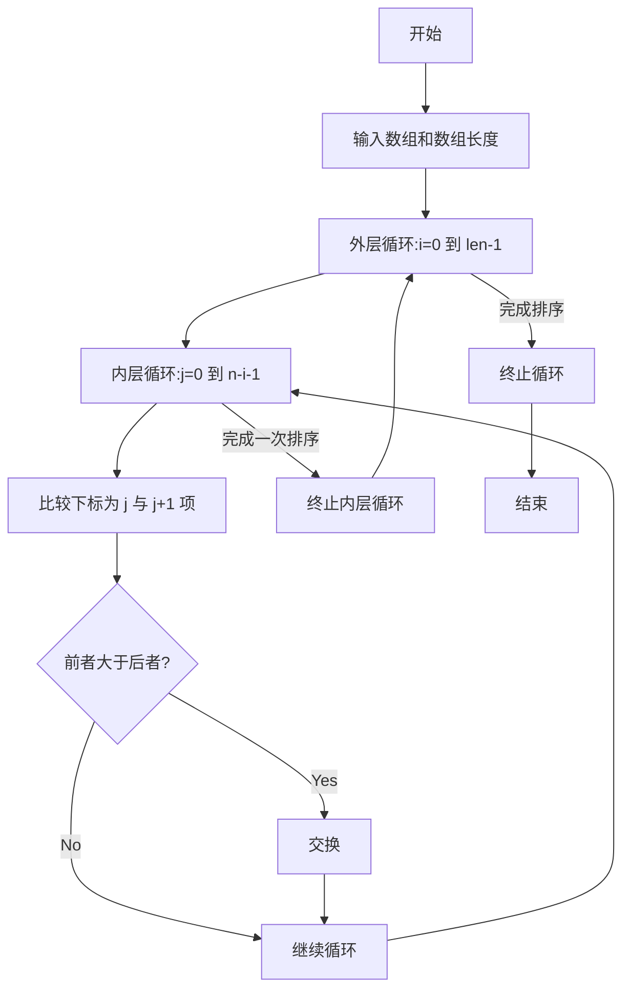
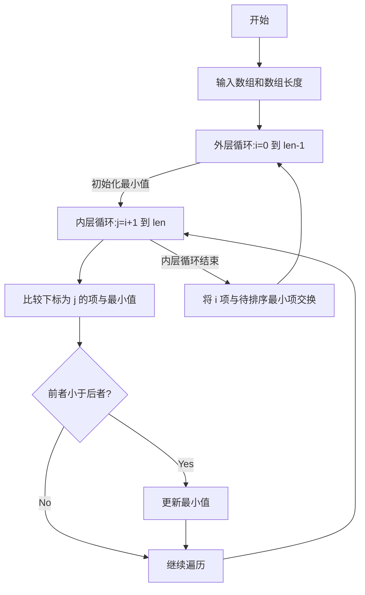

https://www.runoob.com/cprogramming/c-sort-algorithm.html

### 冒泡排序

```c
void bubble_sort(int arr[], int len) {
// arr 传递的是指针，因此是把变量的引用传进去了
    for (int i = 0; i < len - 1; i++) {         
    // 一次内层循环最差排好一个，因此每循环一次少遍历一个元素，i 比最后一个的索引小 1
        for (int j = 0; j < len - 1 - i; j++) { // 第一轮循环 j 的最大值为倒数第二个元素的索引  
            // 交换元素位置（大的往后）
            // 因此最大的会一路排到最后
            // arr[j] < arr[j + 1] 这样改就会把小的往后排
            // 最小的丢最后了，因此同样一次排好一个
            if (arr[j] > arr[j + 1]) {
                int temp = arr[j];              // 存大的
                arr[j] = arr[j + 1];            // 前面存小的
                arr[j + 1] = temp;              // 后面存大的
            }
        }
    }
}
```

假设5个，len=5, len-1=4

| i   | j   | j+1 |
| :-- | :-- | --- |
| 0   | 0~3 | 1~4 |
| 1   | 0~2 | 1~3 |
| 2   | 0~1 | 1~2 |
| 3   | 0   | 1   |



### 选择排序

```c
// 选择排序函数
void selection_sort(int a[], int len) {
    for (int i = 0; i < len - 1; i++) {
    // i 为本次要排好的数
        int min = i;  // 重置最小值的位置，预设为待排序序列中的第一个
        for (int j = i + 1; j < len; j++) {
            if (a[j] < a[min]) {  // 找到目前最小值
                min = j;  // 记录最小值的位置
            }
        }
        // 交换两个变量
        if (min != i) {
            int temp = a[min];
            a[min] = a[i];
            a[i] = temp;
        }
    }
}
```

通过内层循环所有未排序的项，在一次内层循环中找到未排序的最小值置于已排序序列的末尾。让后进入下一次内层循环，从而实现一次循环排好一个。

