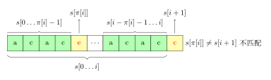

参考：
- [前缀函数（LPS 数组）](https://oi-wiki.org/string/kmp/)
- [next 数组](https://www.cnblogs.com/aninock/p/13796006.html)
- [不同 KMP 算法的总结](https://blog.csdn.net/EightSnow/article/details/107340349)

其中，next 数组表示字符串匹配失配时跳转的索引，而 pi 数组则是模式字符串子串的最长公共前后缀长度。两者可以互相转换。

### 前缀函数

#### 定义

给定一个长度为 $n$ 的字符串 $s$，其 **前缀函数** 被定义为一个长度为 $n$ 的数组 $\pi$。
其中 $\pi[i]$ 的定义是：

1.  如果子串 $s[0\dots i]$ 有一对相等的真前缀与真后缀：$s[0\dots k-1]$ 和 $s[i - (k - 1) \dots i]$，那么 $\pi[i]$ 就是这个相等的真前缀（或者真后缀，因为它们相等）的长度，也就是 $\pi[i]=k$；
2.  如果不止有一对相等的，那么 $\pi[i]$ 就是其中最长的那一对的长度；
3.  如果没有相等的，那么 $\pi[i]=0$。

简单来说 $\pi[i]$ 就是，子串 $s[0\dots i]$ 最长的相等的真前缀与真后缀的长度。

用数学语言描述如下：

$$
\pi[i] = \max_{k = 0 \dots i}\{k: s[0 \dots k - 1] = s[i - (k - 1) \dots i]\}
$$

特别地，规定 $\pi[0]=0$。

#### 朴素算法

```python
def prefix_function(s):  
    n = len(s)  
    pi = [0] * n  
    for i in range(1, n):  
        for j in range(i, -1, -1):  
            # j = i, i-1, ... , 0
            # 从子串的真后缀开始试，尝试到最后也与子串前缀不相等时 pi 为 0
            # python 切片操作包括前面不包括后面，i-j+1 最开始是 1，然后截取到s的末尾  
            if s[0:j] == s[i - j + 1 : i + 1]:  
	            # 此处 [i-j+1:i+1] 表示截取 s[0:i] 的长度为 j 的后缀
                pi[i] = j  
                break  
    return pi
```

- 在一个循环中以 $i = 1\to n - 1$ 的顺序计算前缀函数 $\pi[i]$ 的值（$\pi[0]$ 被赋值为 $0$）。
- 为了计算当前的前缀函数值 $\pi[i]$，我们令变量 $j$ 从最大的真前缀长度 $i$ 开始尝试。
- 如果当前长度下真前缀和真后缀相等，则此时长度为 $\pi[i]$，否则令 j 自减 1，继续匹配，直到 $j=0$。
- 如果 $j = 0$ 并且仍没有任何一次匹配，则置 $\pi[i] = 0$ 并移至下一个下标 $i + 1$。
- 两次循环+字符串得按字符逐个比较，所以时间复杂度 $O(n^3)$

#### 第一个优化

```python
def prefix_function(s):
    n = len(s)
    pi = [0] * n
    for i in range(1, n):
        for j in range(pi[i - 1] + 1, -1, -1):
            if s[0:j] == s[i - j + 1 : i + 1]:
                pi[i] = j
                break
    return pi
```

将 j 的起始数字由 i 改为 `pi[i-1]+1`，这是因为 **相邻的前缀函数值至多增加 1**。

由于只有在子串直接比较成功时，下一次比较才会为字符串比较次数的上限积累 1，而比较不成功时又会使共同前后缀长度减小，消耗下一次比较的字符串比较次数。

因此在最坏情况下，我们有 n-2 次直接比较成功，积累字符串比较次数，然后有 1 次完全比较不成功，消耗积累的次数，这种情况下字符串比较次数为 `n-1 + n-2 = 2n-3`。

因此我们只需要进行 $O(n)$ 次字符串比较，总时间复杂度降为 $O(n^2)$。

#### 第二个优化


在第一个优化中，我们讨论了计算 $\pi[i+1]$ 时的最好情况：$s[i+1]=s[\pi[i]]$，此时 $\pi[i+1] = \pi[i]+1$。现在让我们沿着这个思路走得更远一点：讨论当 $s[i+1] \neq s[\pi[i]]$ 时如何跳转。



如上图所示，失配时，我们希望找到对于子串 $s[0\dots i]$，仅次于 $\pi[i]$ 的第二长度 $j$，使得在位置 $i$ 的前缀性质仍得以保持，也即 $s[0 \dots j - 1] = s[i - j + 1 \dots i]$：

$$
\overbrace{\underbrace{s_0 ~ s_1}_j ~ s_2 ~ s_3}^{\pi[i]} ~ \dots ~ \overbrace{s_{i-3} ~ s_{i-2} ~ \underbrace{s_{i-1} ~ s_{i}}_j}^{\pi[i]} ~ s_{i+1}
$$

如果我们找到了这样的长度 $j$，那么仅需要再次比较 $s[i + 1]$ 和 $s[j]$。如果它们相等，那么就有 $\pi[i + 1] = j + 1$。否则，我们需要找到子串 $s[0\dots i]$ 仅次于 $j$ 的第二长度 $j^{(2)}$，使得前缀性质得以保持，如此反复，直到 $j = 0$。如果 $s[i + 1] \neq s[0]$，则 $\pi[i + 1] = 0$。第二次比较的示意图如下所示


观察上图可以发现，因为 $s[0\dots \pi[i]-1] = s[i-\pi[i]+1\dots i]$，所以对于 $s[0\dots i]$ 的第二长度 $j$，有这样的性质：

$$
s[0 \dots j - 1] = s[i - j + 1 \dots i]= s[\pi[i]-j\dots \pi[i]-1]
$$

该公式的示意图如下所示：


也就是说 $j$ 等价于子串 $s[\pi[i]-1]$ 的前缀函数值，对应于上图下半部分，即 $j=\pi[\pi[i]-1]$。同理，次于 $j$ 的第二长度等价于 $s[j-1]$ 的前缀函数值，$j^{(2)}=\pi[j-1]$.

显然我们可以得到一个关于 $j$ 的状态转移方程：$j^{(n)}=\pi[j^{(n-1)}-1], \ \ (j^{(n-1)}>0)$

**上述摘抄自 OI Wiki，以下是我的理解：**
1. 失配时，我们我们希望找到对于子串 $s[0\dots i]$，仅次于 $\pi[i]$ 的第二长度 $j$，使得在位置 $i$ 的前缀性质仍得以保持，也即 $s[0 \dots j - 1] = s[i - j + 1 \dots i]$
2. 我们必然有 $s[0\dots \pi[i]-1]=s[i-\pi[i]-1\dots i]$
3. 若存在 j，则有 $s[0\dots j-1]=s[i-j+1\dots i]$
4. 这时由于 2.，我们可以将作为 $s[i-\pi[i]-1\dots i]$ 尾部的 $s[i-j+1\dots i]$ 映射至 $[0\dots \pi[i]-1]$ 尾部。
5. 所以有 $s[0\dots j-1]=s[\pi[i]-j\dots \pi[i]-1]$。
6. 因此我们只需求 $s[0\dots \pi[i]-1]$ 是否存在公共前后缀，若存在则这个公共前后缀长度则为 j。
7. 求 $s[0\dots \pi[i]-1]$ 的公共前后缀（j）只需调用前缀函数 $\pi[\pi[i]-1]$

综上，我们在失配时

#### 最终算法

1. $\pi[0]$=0
2. $i=0,1,2\dots n-2$，开始遍历，对于每一个 $i$ 执行如下算法：
3. 初始化 $j=\pi[i]$，此时 $j$ 为最长公共前后缀。
4. 验证 $s[i+1]=s[j]$，若等于则 $\pi[i+1]=j+1$。
5. 若 $s[i+1] \neq s[j]$，则判断 j 是否等于 0。
	1. $j\neq 0$：回到 4，但其中 $j_{新}=\pi[j_{旧}-1]$。从而找到第二/更短的前缀 $j$。
	2. $j=0$ 时，$\pi[i+1]=0$。

实际应用时，可将 i 改为 i+1，来减少不必要的 +1 操作，一个代码实现如下：

```python
def prefix_function(s):
    n = len(s)
    pi = [0] * n
    for i in range(1, n):
        j = pi[i - 1]
        while j > 0 and s[i] != s[j]:
            j = pi[j - 1]
        if s[i] == s[j]:
            j += 1
        pi[i] = j
    return pi
```

### KMP 算法

#### LPS 直接算法

给定一个文本 $t$ 和一个字符串 $s$，我们尝试找到并展示 $s$ 在 $t$ 中的所有出现（occurrence）。

为了简便起见，我们用 $n$ 表示字符串 $s$ 的长度，用 $m$ 表示文本 $t$ 的长度。

我们构造一个字符串 $s + \# + t$，其中 $\#$ 为一个既不出现在 $s$ 中也不出现在 $t$ 中的分隔符。接下来计算该字符串的前缀函数。现在考虑该前缀函数除去最开始 $n + 1$ 个值（即属于字符串 $s$ 和分隔符的函数值）后其余函数值的意义。根据定义，$\pi[i]$ 为右端点在 $i$ 且同时为一个前缀的最长真子串的长度，具体到我们的这种情况下，其值为与 $s$ 的前缀相同且右端点位于 $i$ 的最长子串的长度。由于分隔符的存在，该长度不可能超过 $n$。而如果等式 $\pi[i] = n$ 成立，则意味着 $s$ 完整出现在该位置（即其右端点位于位置 $i$）。注意该位置的下标是对字符串 $s + \# + t$ 而言的。

因此如果在某一位置 $i$ 有 $\pi[i] = n$ 成立，则字符串 $s$ 在字符串 $t$ 的 $i - (n - 1) - (n + 1) = i - 2n$ 处出现。下图所示为索引的示意图。


正如在前缀函数的计算中已经提到的那样，如果我们知道前缀函数的值永远不超过一特定值，那么我们不需要存储整个字符串以及整个前缀函数，而只需要二者开头的一部分。在我们这种情况下这意味着只需要存储字符串 $s + \#$ 以及相应的前缀函数值即可。我们可以一次读入字符串 $t$ 的一个字符并计算当前位置的前缀函数值。

因此 Knuth–Morris–Pratt 算法（简称 KMP 算法）用 $O(n + m)$ 的时间以及 $O(n)$ 的内存解决了该问题。

```python
def find_occurrences(t, s):
    cur = s + "#" + t
    sz1, sz2 = len(t), len(s)
    ret = []
    lps = prefix_function(cur)
    for i in range(sz2 + 1, sz1 + sz2 + 1):
        if lps[i] == sz2:
            ret.append(i - 2 * sz2)
    return ret # 返回 s 在 t 中所有匹配的起始索引列表
```

#### next 数组算法

```python
next_arr = [-1] + pi[:-1]  # 右移一位，首位补 -1
# 例，对于 'ababc'
# pi    = [0, 0, 1, 2, 0]
# next = [-1, 0, 0, 1, 2]
```


如图，我们在字符串 s 中匹配模板字符串 p 时，若在匹配 $s[q]$ 与 $p[i]$ 失配时，可跳转到 $p[\pi[i-1]]$ 来与 $s[q]$ 比较。因为 p 与 s 待匹配字符前都存在一段具有相同前后缀的序列。

$next[0]=-1$ 的原因是：0 被用于跳转至匹配第一个，而 -1 代表第一个就失配，结束跳转。

```python
def KMP(s, p):
    result=[]

    next = [-1]+prefix_function(p)
    # next 比 p 长度大 1，最后一位代表匹配完成时如何继续匹配
    # 若只匹配一次可略去最后一位
    n=len(s)
    j = 0
    for i in range(0,n):
        while j > -1 and s[i] != p[j]:
            j = next[j]
            # j == -1 时必定有 s[i] != p[j]
            # - 若因 s[i] == p[j] 跳出循环，那应当 j++
            # - 若因 j == -1 跳出循环，那也应 j++ 
        j += 1
        if j==len(p):
            result.append(i-j+1)
            j = next[j]
    return result
```


#todo 补上 C 的实现。